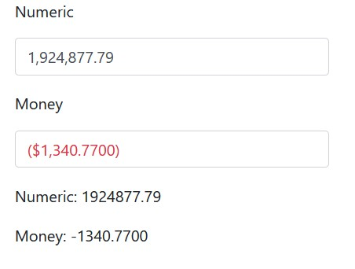

# BlazorNumericTextBox

## Summary

A Numeric TextBox for Blazor.




### Main features

* Localizable
* Custom formatting
* Dynamic CSS classes
* Can set a MaxLength
* Copy and paste compatible

Available on Nuget as BlazorNumericTextBox.


### How to use it

In your index.html file add

```
<script src="_content/BlazorNumericTextBox/numerictextbox.min.js"></script>
```

In your _Imports.razor file add

```
@using BlazorNumericTextBox
```

Now you can add the input in any of your components

```
  <NumericTextBox></NumericTextBox>
```


Customize with:

* @bind-Value: Binds to a **decimal** value.
* Format: Format using any of standard numeric format strings.
* MaxLength: How many characters the user can enter.
* Class: CSS classes to add.
* BaseClass: The CSS class to use for the basic formatting, you need this because if has no styling on its own. By default assumes **form-control** from Bootstrap.
* Id: Customize the id attribute used, it you need to access it using Javascript interop.
* Style: Add a style tag to the output.
* ConditionalFormatting: You can provide a function to apply dynamic classes. In example: change the color for negative values.
* Culture: The culture to use in parsing and formatting the number. Defaults to the value of System.Globalizacion.CultureInfo.DefaultThreadCurrentUICulture.


You end with something like

```
<NumericTextBox @bind-Value="NumericProperty" Format="###,##0.00" Style="max-width:20em;"></NumericTextBox>
```

Check the included sample to see it live.
